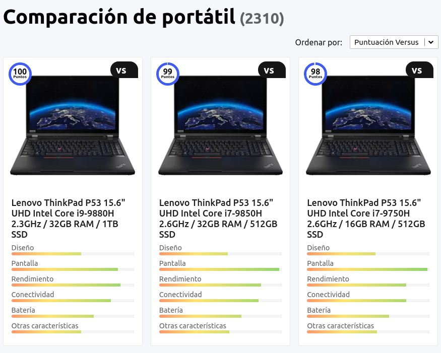

Integrantes:
* Luis Fernando Rodriguez Rodriguez  
* Alvaro Hernan Moller Lima
* Nilson Manuel Contreras 
* Sergio Gabriel Loza Lucero
# Titulo del proyecto " Sistema de informacion, orientacion y ventas de computadoras "

Este Proyecto estara dirigido para orientar a todas las personas que requieran una computadora 
ya que pudimos observar que muchas personas se ven confundidas y desorientadas al momento de buscar una computadora segun su necesidad. 

# ¿Porque del proyecto?
la creacion del sistema facilitara la comunicacion con los clientes proporcionando informacion de las diferentes computadoras y orientara que computadora es mejor para cada cliente segun su necesidad.Su principal atractivo sera que el cliente proporcionara una lista de usos que hace de la computadora, programas en especifico, tiempo de uso (tiempo de vida util) , uso de memoria. El sistema solicitara que el usuario ingrese bastante informacion para que finalmente el 
resultado de las opciones para ese cliente sean entre las mejores. 

# Nicho
El proyecto esta dirigido a cualquier persona que necesite informacion y orientacion en materia de dispositivos tecnologicos.

# ¿Beneficios?
pretendemos que este sistema nos ayude a tener una mejor posicion competitiva dando un mejor servicio al cliente.
tambien queremos que ayude al aumento de ventas de computadoras compartiendo la pagina en redes sociales.Presentara un servicio nuevo en mercado que ayudara a las personas que necesitan una computadora pero no tienen nociones sobre los componentes.

# Propuesta
Proponemos desarrollar un sistema de información que un soporte a las personas en la elección de tecnologías productos tecnológicos. 

Para esto utilizaremos plataformas web de tal forma que los usuarios puedan conectarse desde cualquiera de sus dispositivos, y encuentren información útil sobre computadoras y gadgets. 

# Patrocinador del proyecto (Project sponsor)
El patrocinador del proyecto ""  está comprometido con cada fase del proyecto y sera la persona encargada de proporcionar apoyo y recursos para el exito del proyecto.
El rol del patrocinador del proyecto se puede dividir en tres partes:
- Visión
- Gobernanza
- Valores y beneficios

# Visión
* Alinea el proyecto con la estrategia, metas y objetivos del negocio.
* Permanece informado de los eventos del proyecto para mantener el proyecto viable.
* Define los criterios para el éxito del proyecto y cómo encaja con el negocio general.

# Gobernanza
* Obtiene recursos financieros.
* Se asegura que el proyecto inicie.
* Ofrece apoyo para el proyecto.

# Valores y beneficios
* Ayuda a garantizar el control y los procesos de revisión.
* Ayuda con la toma de decisiones.
* Evalúa el estado y el progreso.

